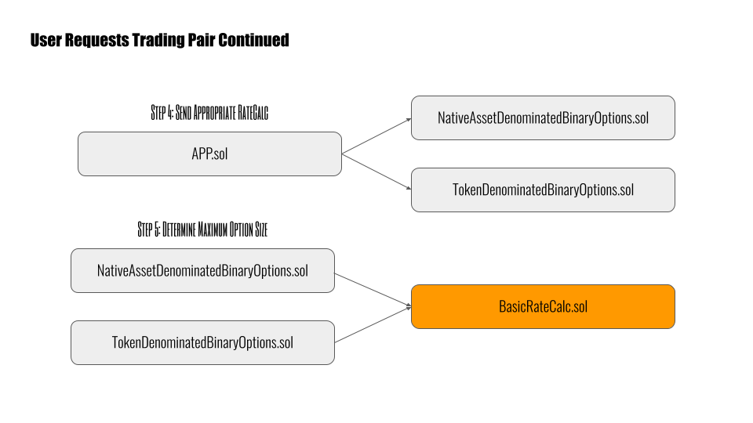
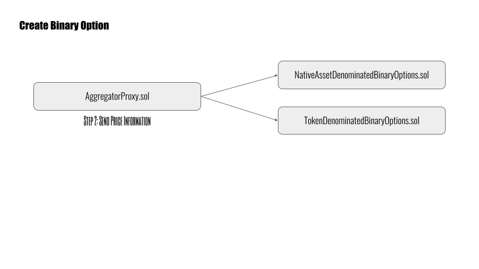

# Biopset V4
A repository of contracts required to deploy version 4 of the Decentralized Binary Option Settlement Protocol. It contains the essential trading protocol and its surronding infrastructure (like the DAO contract, which is used to upgrade the protocol and control its settings).

To learn more about BIOPset please read the [Medium Publication](https://medium.com/biopset).

## Protocol Settings

The protocol charges a 1% fee on ITM options. This and other configurable settings are listed below:

```javascript
protocolFee = 1%
```

## Contract List

Here are a list of the contracts that comprize the protocol:

```javascript
APP.sol
BasicRateCalc.sol
NativeAssetDenominatedBinaryOptions.sol
DAO.sol
ReserveBondingCurve.sol
Treasury.sol
UtilizationRewards.sol
Vesting.sol
TieredVesting.sol
Unlock.sol
DelegatedAccessTiers.sol
TokenDenominatedBinaryOptions/TokenDenominatedBinaryOptions.sol
TokenDenominatedBinaryOptions/TokenDenominatedBinaryOptionsFactory.sol
interfaces/ITokenDenominatedBinaryOptions.sol
interfaces/INativeAssetDenominatedBinaryOptions.sol
interfaces/IAPP.sol
interfaces/IUtilizationRewards.sol
interfaces/IRateCalc.sol
interfaces/IAccessTiers.sol
```

## Contract Descriptions

Please note that **interfaces** are definitions of aspects of the protocol that may have a different implementations later on (like RateCalc).

### AggregatorProxy.sol

The contract retrieving trading pair pricing information from Chainlink. It’s taken from the NPM dependencies and placed in the “Chainlink” folder to make compilation easier. It could be replaced by another provider if necessary.

Interfaces with: TokenDenominatedBinaryOptions.sol and NativeAssetDenominatedBinaryOptions.sol.

### APP.sol

Approved price providers, a set of key value pairs mapping oracle addresses to RateCalc addresses.

Controlled/owned by: DAO.sol.

Interfaces with: NativeAssetDenominatedBinaryOptions.sol and TokenDenominatedBinaryOptions.sol.

Initialization parameters: pp_ the initial price provider(oracle) contract address, rc_ the initial rate calc contract address.

### BasicRateCalc.sol

The default RateCalc that will be deployed and mapped to the first oracle approved in the APP. It is responsible for limiting the percentage of the pool that can be allocated to 1%. This prevents the pool from being depleted before the laws of probability kick in.

Interfaces with: NativeAssetDenominatedBinaryOptions.sol and TokenDenominatedBinaryOptions.sol.

Initialization parameters: none.

### NativeAssetDenominatedBinaryOptions.sol

The main contract of the protocol. Allows traders to open positions, writers the ability to underwrite them, and settlers the ability to settle them. Binary options are denominated in the native asset of the underlying blockchain. On the Ethereum Blockchain, the options are denominated in ETH.

Also keeps surface level record of utilization rewards owed to users.

Controlled/owned by: DAO.sol.

Interfaces with: APP.sol, BasicRateCalc.sol, UtilizationRewards.sol, and GovProxy.sol.

Initialization parameters: name_ the name of the pool token (like Pool ETH), symbol_ the symbol of the pool token(like pETH), biop_ the address of the BIOP token contract, uR_ the address of the utilization rewards contract, app_ the address of the APP contract to be used with this pool at launch.

### DAO.sol

The Settlement DAO essentially. Those staking BIOP tokens use this contract to oversee every aspect of the protocol. It allows them to endorse contracts. Those contracts are then able to update settings and/or swap out contracts of the protocol. In particular, this component of the protocol controls the oracle & RateCalc pairs used.

It also controls the NativeAssetDenominatedBinaryOptions.sol contract.

Interfaces with: NativeAssetDenominatedBinaryOptions.sol, TokenDenominatedBinaryOptions.sol, APP.sol, TokenDenominatedBinaryOptionsFactory.sol, GovProxy.sol, LateStageBondingCurve.sol, and Treasury.sol.

Initialization parameters: bo_ the address of the NativeAssetDenominatedBinaryOptions contract, v4_ the address of the deployed BIOP token contract, accessTiers_ the address of the deployed DelegatedAccessTiers contract, factory_ the address of the TokenDenominatedBinaryOptionsFactory contract, trsy_ the address of the Treasury contract.

### ReserveBondingCurve.sol

An automatic market maker (or "**AMM**") for BIOP governance tokens. The purpose is to ensure there is always a marketplace for buying and selling BIOP tokens. It is not to be activated until after DEX rewards are complete.

Controlled/owned by: DAO.sol.

Initialization parameters: token_ the address of the BIOP token contract, _reserveRatio the ratio (initial price) of tokens to ETH (intended to be 500000 in testing).

### Treasury.sol

The treasury of funds amassed from protocol fees on ITM options. It is collectively managed by Settlement DAO members staking their BIOP governance tokens. Wheneve the treasury's ETH is spent, a percentage is sent to DAO stakers. Can be used to send amassed funds to anywhere by approved by the Settlement DAO.

Controlled/owned by: DAO.sol.

Initialization parameters: none.

### UtilizationRewards.sol

holds and then disperse funds to traders, settlers, and writers using NativeAssetDenominatedBinaryOptions (but not TokenDenominatedBinaryOptions). Designed to be used over multiple "epochs". Controlled/owned by SettlementDAO. Interfaces with NativeAssetDenominatedBinaryOptions. Users call a method on NativeAssetDenominatedBinaryOptions to receive funds from the UtilizationRewards. The only direct calls to the UtilizationRewards are made by the Settlement DAO when depositing funds or updating contracts.


Initialization Parameters: token_ the address of the BIOP token contract, maxEpoch_ the total number of epochs(rounds) the rewards should run for, launchTime how long the initial bonus rewards should last for, epochLength how long(in seconds) each epoch(round) of rewards goes for.

### Vesting.sol

For vesting team tokens over the given period. No cliff, once setup only the claimant can call the relevant funds and is able to transfer the claimant roll to other addresses at their discretion. Does not interface with other contracts.


Initialization Parameters: claimant_ the address of the user who will receive the vested tokens, tokenAddress_ the address of the BIOP token contract.


### TieredVesting.sol

For vesting things like UtilizationReward tokens not activated yet. No cliff. Does not interface with other contracts.

Initialization Parameters: claimant_ the address of the user who will receive the vested tokens, tokenAddress_ the address of the BIOP token contract, tiers_ the number of tiers to split the token vesting into, tierLength_ the length(in seconds) of each tier.

### Unlock.sol

For vesting things like LateStageBondingCurve tokens that activate all at once at a specific date. Does not interface with other contracts.


Initialization Parameters: claimant_ the address of the user who will receive the vested tokens, tokenAddress_ the address of the BIOP token contract.

### DelegatedAccessTiers.sol

used by the DAO to protect access to actions. defines a number of guard functions to check if a user has sufficient endorsement power to call a action. Interfaced with by DAO and uses structure of IAccessTiers.

Initialization Parameters: none.

### TokenDenominatedBinaryOptions/TokenDenominatedBinaryOptions.sol

TokenDenominatedBinaryOptions based binary options trading. Any fees it generates are sent directly to the Treasury. Created by TokenDenominatedBinaryOptionsFactory. Controlled/owned by the Settlement DAO. Interfaces with APP.


Initialization Parameters: name_ the name of the pool token (like Pool ETH), symbol_ the symbol of the pool token(like pETH), token_ the address of the ERC20 token that will be used for this pool(and to buy binary options from it), dao_ the address DAO which will manage this pool, app_ the address of the APP contract to be used with this pool at launch, treasury_ the address of the DAO Treasury contract.

### TokenDenominatedBinaryOptions/TokenDenominatedBinaryOptionsFactory.sol

Handlles creation of new TokenDenominatedBinaryOptions contracts. Controlled/owned by the Settlement DAO. Also contains a key value mapping of ERC20 addresses to TokenDenominatedBinaryOptions addresses used by the Settlement DAO to determine if a TokenDenominatedBinaryOptions exists for a arbitrary TokenDenominatedBinaryOptions already. Allows deactivation of a TokenDenominatedBinaryOptions address.


Initialization Parameters: none.


### interfaces/ITokenDenominatedBinaryOptions.sol

interface for TokenDenominatedBinaryOptions.

### interfaces/INativeAssetDenominatedBinaryOptions.sol

interface for NativeAssetDenominatedBinaryOptions.

### interfaces/IAPP.sol

interface for APP.

### interfaces/IUtilizationRewards.sol

Interface for UtilizationRewards.

### interfaces/IRateCalc.sol

Interface for RateCalcs.

### interfaces/IAccessTiers.sol

Interface for AccessTiers.

## The Process For Creating BIOPSET Options







## Settlement DAO Actions
Things you can do with a high enough percentage of staked $BIOP.

When changing high tier actions its recommended that voting power be delegated to pre-deployed well read smart contracts and not individual users accounts.


### Tier 1🌲
These actions require low consensus from the staked community members.
 - Update Max Rounds: Change the maximum time an option can be created for.
 - Update Min Rounds: Change the minimum time an option can be created for.

### Tier 2🤝🤝
These actions require a larger consensus and have larger consequences.
 - Update Settlement Bounty: Change the amount received to exercise or expire a option someone (including you) has created.
 - Add/Remove/Update Oracle RateCalc pair that traders can use with the protocol pool.
 - Pause/Restart Rewards: Flip the switch to enable or disable utilization rewards in the protocol.
 - Harness Treasury Funds: Direct any percentage of total available treasury funds to a specific address.
 - Enable Utilization Rewards.

### Tier 3🔥🔥🔥  
These actions aren't as potentially foundation shaking as Tier 4 but are hot.
 - Update protocol Fee: Update the percentage (2 decimal precision) fee charged to every trade and sent to the proxy.
 - Update Soft Lock Time: Change the minimum amount of time that pool participants must stake for in order to avoid any exit fee.
 - Update Staking Rewards Epoch: Change the interval at which pool staking utilization rewards compound.
 - Replace APP: Activate a new Approved Price Providers contract which contains the list of approved Oracle / RateCalc pairs.
 - Update UtilizationRewards owner.
 - Deactivate TokenDenominatedBinaryOptions: remove a TokenDenominatedBinaryOptions instance when a new version is being introduced.

### Tier 4🌏🌏🌏🌏
These actions require the greatest consensus around staked participants.
- Update Direct Distribution: Change the amount of tokens which are sent from the proxy to all $BIOP stakers evenly and do not go to the DAO treasury.
 - Update Consensus Tiers: Change the percentage of staker support needed to access the Settlement DAO tiers of actions.
 - Shutdown A Token: Depreciate a EOL token if the contract is being replaced (this changes the token used to judge participation levels in the Settlment DAO).
 - Replace Rewards Contract: Setup a new rewards contract to distribute governance tokens as utilization rewards to protocol participants on pool.
 - Update Treasury Address: Switch the treasury contract being used by the Settlement DAO.
 - Update Treasury Owner
 - Update Proxy Owner
 - Update Treasury
 - Update Stakers percent: change the amount that is distributed evenly to stakers whenever treasury ETH is spent.

#### initial delgation tier ratios
- T0 = (any amount above 0.000000000000000100)
- T1 = (50%)
- T2 = (66%)
- T3 = (75%)
- T4 = (90%)

## Testing Instructions

1. Download the repository.

```bash
git clone https://github.com/BIOPset/v4-contracts.git
```

2. Navigate into a command line within the v4-contracts folder.

```bash
cd v4-contracts
```

3. Run NPM install.

```bash
npm install
```

4. Globally install ganache-cli to your system.

```bash
npm install -g ganache-cli
```

5. Globally install truffle to your system.

```bash
npm install -g truffle
```

6. Launch ganache-cli.

```bash
ganache-cli
```

7. In a seperate command line window within the same v4-contracts folder, run truffle test.

```bash
truffle test
```
